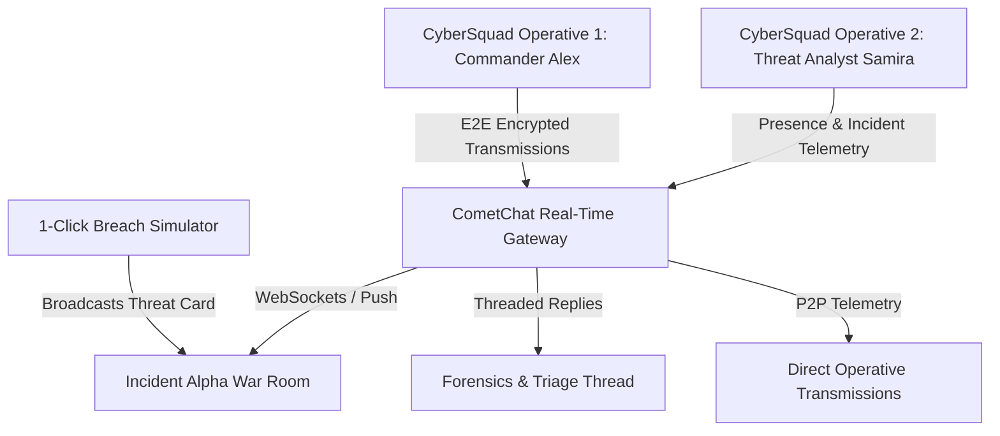

# 🛡️ CyberSquad — Incident Response & SOC Collaboration Hub

> **A real-time, mission-critical incident command and threat collaboration platform built for cybersecurity teams.** Powered by **React + Vite** and the **CometChat React v7 UI Kit**.


---

## 🚨 Problem Statement

During an active cybersecurity breach or critical infrastructure outage:
1. **Generic chat tools (Slack, Teams)** are cluttered with non-security noise and lack domain-focused incident triaging.
2. **Alert fatigue & fragmented context** slow down containment times (Mean Time to Remediate - MTTR).
3. **Security squads need dedicated war rooms**, threaded investigative forensic streams, and rapid role-based collaboration between Commanders, Threat Hunters, and SOC Leads.

---

## ⚡ Solution: CyberSquad

**CyberSquad** is purpose-built for tactical cybersecurity response:
* **Real-time Incident War Rooms**: Dedicated channels for triage (`🚨 Incident Alpha Response`), intelligence sharing (`🛡️ Threat Intel & IOCs`), and general squad dispatch (`⚡ CyberSquad Operations HQ`).
* **Tactical Command Terminal**: 1-click operative deployment allowing seamless multi-agent switching between Commander, Threat Analyst, and Incident Responder.
* **1-Click Breach Simulation**: Broadcast realistic critical threat alerts (CVE exploits, ransomware beaconing, DDoS attacks) to test and showcase squad coordination in real time.
* **Interactive DEFCON Readiness**: Live visual DEFCON level cycling (DEFCON 5 Normal ➔ DEFCON 3 Elevated ➔ DEFCON 1 Breach Imminent).
* **Threaded Incident Investigations**: Deep-dive triage threads keeping containment discussions organized without polluting main channels.
* **Scoped In-Chat & Global Search**: Rapid IOC and hash lookup across transmissions.

---

## 🏗️ Architecture & Communication Flow



---

## 🛠️ Technology Stack

* **Frontend Framework**: React 19 + Vite
* **Real-Time Communication**: [@cometchat/chat-uikit-react v7](https://www.npmjs.com/package/@cometchat/chat-uikit-react) & [@cometchat/chat-sdk-javascript v4](https://www.npmjs.com/package/@cometchat/chat-sdk-javascript)
* **Styling**: Vanilla CSS Design System with dark cybersecurity palette, tactical radar sweep, and glassmorphic HUD
* **Sanitization & Safety**: `dompurify`
* **Agent Infrastructure**: CometChat AI Skills Engine (`@cometchat/skills`)

---

## 🚀 Getting Started

### 1. Clone & Install Dependencies
```bash
git clone https://github.com/your-username/cybersquad.git
cd cybersquad
npm install
```

### 2. Configure Environment
Create a `.env` file in the project root:
```env
VITE_COMETCHAT_APP_ID=your_cometchat_app_id
VITE_COMETCHAT_REGION=in
VITE_COMETCHAT_AUTH_KEY=your_cometchat_auth_key
```

### 3. Launch Development Server
```bash
npm run dev
```
Open **`http://localhost:5173`** in your browser.

---

## 🎯 2-Minute Hackathon Demo Script

1. **Terminal Deployment**: Open `http://localhost:5173` and click **DEPLOY** on **Alex Mercer (Commander)**.
2. **Second Operative (Dual-Tab)**: Open a second tab or incognito window, deploying as **Elena Rostova (Incident Responder)**.
3. **Simulate Live Breach**: In the top navigation bar, click the **`⚡ SIMULATE BREACH ALERT`** button.
   * A critical incident alert (`Unauthorized Privilege Escalation CVE-2024-38077` or `Ransomware Beaconing`) is automatically broadcasted to the **Incident Alpha War Room**.
4. **Live Coordination**: Watch the alert appear instantly in both tabs via CometChat's real-time WebSockets.
5. **Threaded Investigation**: Hover over the alert and click **Reply in thread** to document containment steps without cluttering the main room.
6. **DEFCON Shift**: Click the **DEFCON status badge** in the navbar to escalate readiness to **DEFCON 1 (ACTIVE BREACH)**!

---

## 👥 CyberSquad Roster

| Operative | Callsign | Role | Specialty |
| :--- | :--- | :--- | :--- |
| **Alex Mercer** | `VIPER-01` | Squad Commander | Tactical Command & Escalation |
| **Samira Chen** | `GHOST-02` | Threat Intel Analyst | IOC Correlation & Threat Hunting |
| **Elena Rostova** | `AEGIS-03` | Incident Responder | System Containment & Forensics |

---

## 📄 License
MIT License. Built for the Hackathon with CometChat.
